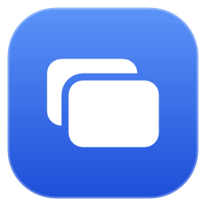

# PasteJump

<!--
    Referenced where it lives rather than copied to the repo root: it is generated by
    tools/generate-icon.ps1 alongside the .ico, and a second copy would drift the first time the mark changed.
-->


<!-- First because it is the only badge that reports something: the rest state facts that do not change. -->
[](https://github.com/lokeshgovindu/PasteJump/actions/workflows/build.yml)
[](https://dotnet.microsoft.com/)
[](#getting-started)
[](#run-it)
[](LICENSE)

A keyboard-driven multiple-clipboard manager for Windows.

Hold <kbd>Ctrl</kbd>, tap <kbd>V</kbd> to step back through what you have copied, release to paste.
That gesture — a *jog wheel* for your clipboard — is the whole point.

Built with .NET 10 and WPF. Ships as **a single self-contained `PasteJump.exe`** — no .NET runtime
needed on the target machine, nothing to install, and nothing beside it.

Two things beyond the jog wheel are worth knowing about up front:

- **Join several clips into one paste.** Select several rows in the history window and Copy becomes *Copy Joined* —
  they paste as *one* clip rather than one after another, with a separator of your choosing; images are left out and
  counted. There is a key for doing the same during the gesture, **switched off by default** because most people
  paste twice rather than mark twice: give it a letter under *Settings → Keys*.
- **Seventeen themes beyond Light and Dark, and you can write your own.** A theme is a small `.json` file of named colours that inherits
  everything it does not set, so a three-line file is a valid theme. Solarized, Catppuccin, Nord, Dracula, Tokyo
  Night, Monokai, Gruvbox, Kanagawa and more are built in, and the theme applies as you step through the list.

---

## Why this exists

PasteJump is a ground-up reimplementation of [aviaryan/Clipjump](https://github.com/aviaryan/Clipjump),
an excellent AutoHotkey v1 utility whose last commit was April 2016. The gesture it invented is
still, as far as I can tell, unique — no other clipboard manager lets you walk a stack without ever
opening a window or moving your hands. But AHK v1 made it effectively unmaintainable: no debugger,
no tests, ~60 mutable globals, `gosub` control flow, and runtime string-based variable dereferencing.

This is a reimplementation from observed behaviour, not a port. No Clipjump code was copied.

---

## Getting started

### Run it

```
dotnet publish src/PasteJump.App/PasteJump.App.csproj -c Release -o artifacts/publish
artifacts/publish/PasteJump.exe
```

It lives in the notification area. Left-click for history, right-click for the menu. What the left button does is
configurable under **Settings → System** &mdash; the menu, settings, or nothing &mdash; because plenty of tray
programs open their menu on a left click. Right-click always opens the menu.

That produces one file and nothing else. Data goes in a `data/` folder next to the executable, so it stays
portable — copy the exe to a USB stick and it takes its history with it.

~65 MB is the floor, not laziness: WPF supports neither trimming nor NativeAOT, and .NET 10 is not part of
Windows, so a build that needs no runtime installed has to carry all of it. (A .NET Framework app can be a
few MB precisely because Windows already ships its runtime.)

**Settings → System** locates the clips and the settings independently:

| Setting | Covers | Move it when |
|---|---|---|
| **Store clips in** | database, image blobs | the program folder is not writable (unzipping under `C:\Program Files` is the usual way to find out), or you want one history shared across several copies |
| **Store settings in** | `PasteJump.json` | rarely — keeping it beside the program is what lets a portable copy carry its own configuration |

Either can be *My user profile*, which is `%LOCALAPPDATA%\PasteJump`. PasteJump restarts, copies that
half across, and leaves the old copy for you to delete.

### Running alongside another clipboard manager

You mostly cannot, and it is worth knowing why. Windows shows keystrokes that one program injects to
*every* keyboard hook on the machine, so a second clipboard manager holding <kbd>Ctrl</kbd>+<kbd>V</kbd>
intercepts the paste PasteJump sends before the application you are pasting into ever sees it. The
symptom is distinctive: **copying keeps working and pasting silently does nothing**, because capture
watches the clipboard rather than the keyboard.

PasteJump detects the common managers at start-up and says so. **The remedy is to close the other one**, and
in this release that is the only remedy.

Two settings exist that would give each program a chord of its own, fixing opposite halves of the problem, but
both are **disabled in the UI** pending more work — greyed out under **Settings → Paste mode**:

- **Keystroke sent to paste** → <kbd>Shift</kbd>+<kbd>Insert</kbd> would change what PasteJump *sends*, so the
  other manager's hook has nothing to swallow. Tried against a real conflict it did not help, which is part of
  why it is switched off rather than offered as a fix.
- **Hold Ctrl and tap this key** → any free letter would change what PasteJump *listens for*, so the two stop
  competing for <kbd>Ctrl</kbd>+<kbd>V</kbd> at all. The more promising of the two.

### Two ways to get it

```
powershell -ExecutionPolicy Bypass -File tools/pack-release.ps1
```

That produces both packages in `artifacts/release`, each with a SHA256 and each carrying the exe, the CHM
manual, this README and the licence:

| | Contents | Download | Start-up, warm | Needs |
|---|---|---|---|---|
| **`PasteJump-<ver>-win-x64.zip`** | one `PasteJump.exe` | 60 MB | ~1.26 s | nothing |
| **`PasteJump-<ver>-win-x64-unpacked.zip`** | the same build, runtime unpacked (257 files) | 59 MB | **~0.29 s** | nothing |
| **`PasteJump-<ver>-win-x64-net10.zip`** | PasteJump only, 15 files | **2.6 MB** | ~0.29 s | .NET 10 Desktop Runtime |
| **`PasteJump-<ver>-setup.exe`** | the unpacked build, installed per-user | 45 MB | **~0.29 s** | nothing |

The unpacked ZIP is *no larger* than the single-file one, because a single-file bundle is already compressed and
zipping it again gains almost nothing - so the shape that starts four times faster costs nothing to download.

The difference is not the app — it is the deployment shape. A single-file build spends about a second on
every launch extracting its bundle and decompressing assemblies *before any of PasteJump's code runs*, which
is a fine price for something you carry on a USB stick and a pointless one once an installer is putting files
in a directory anyway. The installer therefore ships the folder build and starts 4.4× faster.

One honest caveat: the *first* launch after installing is slower (~6.6 s against ~4.5 s), because Windows
Defender scans 255 new files instead of one. Every launch after that is the fast one.

The installer is **per-user**, into `%LOCALAPPDATA%\Programs\PasteJump`, and needs no elevation — which is
also what keeps `data\` beside the executable writable. Uninstalling leaves your clips, history and settings
exactly where they are.

### Build and test

```
dotnet build
dotnet test
```

### The help file

A compiled HTML Help manual is built separately, since it needs an external tool that a build machine may not
have:

```
powershell -ExecutionPolicy Bypass -File tools/update-help-images.ps1   # after a UI change
powershell -ExecutionPolicy Bypass -File tools/build-help.ps1 -Show
```

Sources are in `docs/help`; the result is `artifacts/help/PasteJump.chm` (~540 KB, nine topics, twenty
screenshots). It needs `hhc.exe` from Microsoft's HTML Help Workshop.

The screenshots are **produced by the UI smoke harness**, not taken by hand, so they cannot drift from the
real XAML — `update-help-images.ps1` runs it and copies the light-theme shots into `docs/help/images`. They are
checked in, so building the help does not require starting WPF.

The `.chm` is not shipped beside the exe — the deployment is deliberately one file — so it is a standalone
document to publish with a release.

---

## The gesture

Press <kbd>Ctrl</kbd>+<kbd>V</kbd> and **keep Ctrl held**. An overlay appears near your caret.
While Ctrl is down:

| Key | Action |
|---|---|
| <kbd>V</kbd> · <kbd>↓</kbd> <kbd>→</kbd> | Step to an older clip |
| <kbd>C</kbd> · <kbd>↑</kbd> <kbd>←</kbd> | Step back to a newer clip |
| <kbd>A</kbd> · <kbd>Home</kbd> | Jump to the newest clip |
| <kbd>End</kbd> | Jump to the oldest clip |
| <kbd>1</kbd>–<kbd>9</kbd> | Jump that many clips (numpad too) |
| <kbd>-</kbd> | Reverse the direction the number keys jump (numpad too) |
| <kbd>Delete</kbd> | Delete this clip now and carry on browsing |
| <kbd>X</kbd> | Cycle what release will do: Cancel → Delete → Delete All |
| <kbd>P</kbd> · <kbd>Space</kbd> | Pin / unpin (pinned clips sort first and survive Delete All) |
| <kbd>M</kbd> · <kbd>Q</kbd> | Move this clip to the front of the stack |
| <kbd>Z</kbd> | Cycle paste format |
| *(no key)* | Mark this clip; releasing <kbd>Ctrl</kbd> pastes every marked clip joined into one. Off by default — give it a letter under *Settings → Keys* |
| <kbd>K</kbd> | Show only one kind of clip: all → text → images → files |
| <kbd>T</kbd> | Edit tags |
| <kbd>S</kbd> | Put the clip on the Windows clipboard *without* pasting |
| <kbd>O</kbd> | Open the clip in an external editor |
| <kbd>H</kbd> | Open the clipboard history window - this ends the gesture |
| <kbd>E</kbd> | Export the clip to a file |
| <kbd>F</kbd> | Open incremental search |
| <kbd>Backspace</kbd> | Delete a character from the search query |
| <kbd>Enter</kbd> | Paste and stay open, for pasting several clips in a row |
| <kbd>F1</kbd> | Show this list — this ends the gesture, since the window takes the keyboard |
| release <kbd>Ctrl</kbd> | Paste |
| <kbd>Shift</kbd> pressed *after* the overlay opens | Paste, then delete the clip ("paste popping") |
| <kbd>Esc</kbd> | Cancel and restore the previous clipboard |

**The letters are yours to move.** *Settings → Keys* binds any action to any letter, or switches it off. The
physical keys — arrows, <kbd>Home</kbd>, <kbd>End</kbd>, <kbd>Delete</kbd>, <kbd>Enter</kbd>, <kbd>Esc</kbd>,
<kbd>F1</kbd> — stay put on purpose, so no set of bindings can leave you unable to step through the stack or get
out of it. <kbd>F1</kbd>'s key card shows your letters, not the defaults.

Where two keys are listed, both work. The letters are Clipjump's layout and are not going away; the arrows,
<kbd>Home</kbd>/<kbd>End</kbd>, <kbd>Delete</kbd>, <kbd>O</kbd>, <kbd>P</kbd> and <kbd>M</kbd> were added beside
them. <kbd>H</kbd> is the one key that changed meaning: it opened the editor in Clipjump, which read as "help",
and now opens the history - the editor answers to <kbd>O</kbd>.

**Only <kbd>Ctrl</kbd>+<kbd>V</kbd> starts the gesture.** Any extra modifier passes straight through, because
each one belongs to somebody else: <kbd>Ctrl</kbd>+<kbd>Shift</kbd>+<kbd>V</kbd> is how terminals paste and how
browsers paste as plain text, <kbd>Ctrl</kbd>+<kbd>Alt</kbd>+<kbd>V</kbd> is <kbd>AltGr</kbd>+<kbd>V</kbd> on
many layouts, and Win chords belong to the shell. Paste popping is reached by adding <kbd>Shift</kbd> once the
overlay is already up.

In search mode you can let go of Ctrl and just type; it filters on clip content **and** tags.
<kbd>Enter</kbd> pastes the match, <kbd>Esc</kbd> cancels.

<kbd>V</kbd> is only the default. **Settings → Paste mode → Hold Ctrl and tap this key** will move the
gesture to any letter not already used above — useful if something else on your machine owns
<kbd>Ctrl</kbd>+<kbd>V</kbd>. There is also an optional system-wide shortcut for the history window under
**Open history with**, off by default since a global hotkey takes that chord from every other application.

Paste formats: Original, Plain text, Collapse whitespace, Sentence case, Unindent.

---

## Two stores: clips and history

PasteJump keeps what you copy in **two** places, and confusing them is the single easiest thing to do here.
Clipjump does the same — `cache/clips` and `cache/history` are separate directories there — for the reason
below.

| | **Clips** (the stack) | **History** (the archive) |
|---|---|---|
| What it is | the clipboards the gesture pastes from | a log of everything you have copied |
| Reached by | <kbd>Ctrl</kbd>+<kbd>V</kbd> | the history window (tray icon, or **Open history with**) |
| Holds | **every clipboard format** of each copy | one preview, plus at most one blob |
| Bounded by | a clip count — **Maximum clips kept**, default 200 | a period — **Days of history to keep**, default 180 |
| Searchable | by content and tags, during the gesture | full-text, in the history window |
| Pinning | yes | no |
| Cleared by | <kbd>X</kbd> ×3 → DELETE ALL, during the gesture | **Clear History** in the history window |

**Why two.** A clip in the stack is the *complete* clipboard: copy a range from Excel and that is 25 formats
and about 90 KB — `Biff12`, `XML Spreadsheet`, HTML, RTF, a bitmap, and twenty more. Replaying all of it is
what makes a paste indistinguishable from the original <kbd>Ctrl</kbd>+<kbd>V</kbd>, and it is why the stack
is capped by count rather than kept for ever. History stores a flattened record of the same copy — the text
preview, or one image — which is cheap enough to keep tens of thousands of and to index for search.

**What follows from that:**

- Deleting a clip during the gesture does **not** remove its history entry. Clearing history does **not**
  shorten what <kbd>Ctrl</kbd>+<kbd>V</kbd> offers. Each is cleared on its own.
- A clip pushed out of the stack by the count limit is still in history — you can find it and copy it back,
  but you get the flattened version.
- **Copy** in the history window puts the entry on the clipboard **and adds it to the stack as the newest
  clip**, so <kbd>Ctrl</kbd>+<kbd>V</kbd> offers it first. That is what makes an archive — an imported Clipjump
  history especially — worth having rather than merely searchable. What comes back is the flattened record
  though: text or an image, not the original formatting. Formatting survives only while the clip is still in
  the stack, where every format it was copied with is kept.
- **Copy** in the clips view replays every format and moves that clip to the front, which is what <kbd>Q</kbd>
  does during the gesture.
- Text longer than 4096 characters is archived in full alongside the preview, so history search still finds
  it; that limit is why the preview column is capped and the full text kept separately.

Both live in one SQLite database — `data/pastejump.db`, beside the executable by default — as the `clip` and
`history` tables. Payloads too large to sit in a row go to `data/blobs`, content-addressed and deflated.

---

## What is deliberately not here

Clipjump had features this does not, dropped on purpose to keep the surface honest:

- **Channels** (multiple independent clipboard stacks) and the Channel Organizer. Consequently the
  channel keys — Up, Down, PitSwap — do not exist, and the <kbd>X</kbd> cycle has no Move or Copy
  stages, since those moved clips *between channels*.
- **The plugin system** and the `WM_COPYDATA` public API. Replaced by five built-in formatters.
- **Localisation.** English only, though all user-facing strings are in one place.
- **Action Mode**, copy-file-path, hold-clip, one-time-stop, incognito, and the ignore-windows
  manager. A simpler per-process ignore list covers the case that actually matters.

---

## Architecture

```
src/
  PasteJump.Core      Domain logic. net10.0, deliberately NOT net10.0-windows.
                    Paste-mode state machine, clip store, formatters, capture
                    orchestration. No Win32, no WPF, no message loop — so it is
                    all unit-testable.
  PasteJump.Interop   Win32 implementations of the Core abstractions. Clipboard
                    access, the low-level keyboard hook, SendInput, tray icon,
                    message-only window.
  PasteJump.Import    One-time migration of Clipjump 12.x history.
  PasteJump.App       WPF: overlay, history window, settings, tray wiring.
tests/
  PasteJump.Core.Tests      480 tests over the state machine, store, capture path,
                          formatters and importer.
  PasteJump.Interop.Probe   Phase 0 spike harness. Not shipped.
```

Three decisions dissolve most of the original's complexity:

**1. The system clipboard is never used as scratch space.** Clipjump wrote clip #7 *to the
clipboard* in order to preview it, which is the root of its retry loops, its `ONCLIPBOARD` flag
protocol, and an invisible focus-stealing window created to appease Excel. PasteJump reads the
clipboard once per change, stores every format, renders all previews from its own store, and touches
the clipboard again only at the instant of pasting.

**2. Clip identity is not clip position.** In Clipjump a clip *was* its array index — the file
`cache\clips\7.avc` was clip 7 — so deleting or reordering anything cascaded file renames across
three parallel directories. Here clips have immutable ids and a fractional `sort_key`, so
repositioning a pinned clip is one `UPDATE` and nothing on disk moves.

**3. Self-inflicted clipboard changes are recognised by content hash.** Pasting writes to the
clipboard, which raises a change notification that would otherwise be captured as a new clip.
Clipjump guarded this with a mutable flag plus a 200 ms time-difference heuristic — both had timing
windows. Hashing what we wrote has no timing component at all.

### Storage

SQLite (WAL) with FTS5 over history previews, plus a content-addressed blob directory for payloads
over 256 KB. Content addressing gives deduplication for free: copying the same screenshot five times
costs one file.

Clipboard formats are stored with their **registered names**, not just their numeric ids — ids from
`RegisterClipboardFormat` are only stable for the lifetime of a Windows session, so replaying a
stored id tomorrow would attach the bytes to an unrelated format.

---

## Migrating from Clipjump

On first run PasteJump looks for a Clipjump installation and offers to import. The source folder is opened
read-only via a temporary copy and is never modified. Imported rows are tagged `clipjump-12.5` so they can be
identified later.

**Both halves come across:** the history archive, and the clip stack from the `.avc` files — newest first and
capped at your clip limit, so imported clips can actually be pasted with the gesture rather than only searched.
Those files hold AutoHotkey's own `ClipboardAll` serialisation, a sequence of `{format, size, bytes}` records;
text, images and file lists survive, while formats identified only by a session-scoped id are dropped rather
than guessed at.

**Running the import twice is safe** — an entry already present is recognised and left alone. That was not
true before: the dialog said so while nothing checked, so each run inserted another copy of everything. If you
imported more than once, **Remove Duplicates** in the history window repairs it.

Watch for one conflict: **Days of History to Keep** prunes at every start-up, so importing years of history
under a 180-day retention deletes most of it at the next launch. PasteJump spots this and offers to switch
retention off.

---

## Known limitations

- **An image clip's reported size is still larger than the original file, and that is correct.** The
  clipboard carries images uncompressed, so a 146 KB PNG arrives as megabytes of raw pixels; the size column
  reports what the clipboard actually handed over. Duplicate encodings of the same image are now dropped at
  capture and everything on disk is deflated, so the stored cost is a small fraction of the figure shown.
  Comparing it against Clipjump's number is misleading — Clipjump displays the size of the lossy JPEG
  thumbnail it generates, not of the clip.
- **A capture can still be lost under heavy clipboard contention.** The clipboard is a machine-wide
  lock. PasteJump retries with backoff (~620 ms inline) and then twice more on a delay, but if another
  process holds the clipboard longer than that, the copy is dropped and
  `CaptureService.DroppedCaptureCount` increments. This is inherent to the Win32 clipboard, not
  fixable in principle — only made rarer.
- **Elevated windows.** A non-elevated keyboard hook cannot see keystrokes in elevated windows, so
  the gesture does not work in them. Running PasteJump elevated via a scheduled task fixes it, at the
  cost of a UAC prompt at setup.
- **~65 MB on disk**, compressed from 143 MB. WPF supports neither trimming nor NativeAOT, so a build that
  needs no runtime installed is large. Accepted trade: the alternative was hand-writing every window in
  Win32. Compression also means each start decompresses assemblies, which costs a little launch time.
- **The application icon is a generated placeholder** (`tools/generate-icon.ps1`), not a designed
  asset.
- **Windows on ARM** needs a separate `win-arm64` publish; only `win-x64` is built today.

---

## Credit

The interaction design is Avi Aryan's. [Clipjump](https://github.com/aviaryan/Clipjump) is
Apache-2.0; this is an independent implementation of its observed behaviour and carries none of its
code.

---

## Licence

[MIT](LICENSE). Copyright (c) 2026 Lokesh Govindu.

The generated application icon (`tools/generate-icon.ps1`) is covered by the same terms — it is drawn
from primitives by that script, not taken from an icon set.
